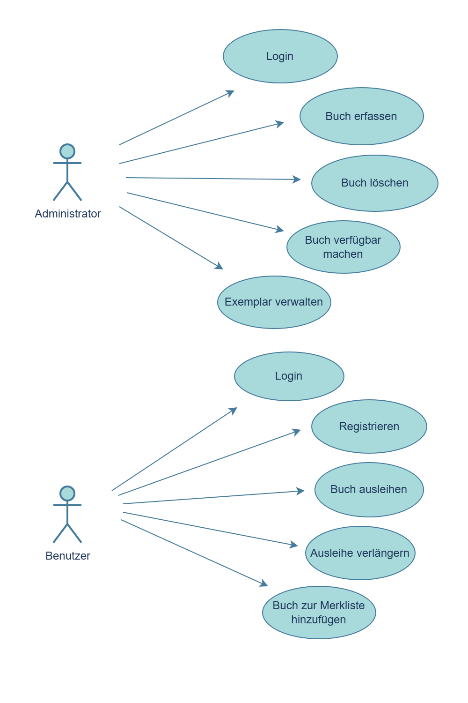
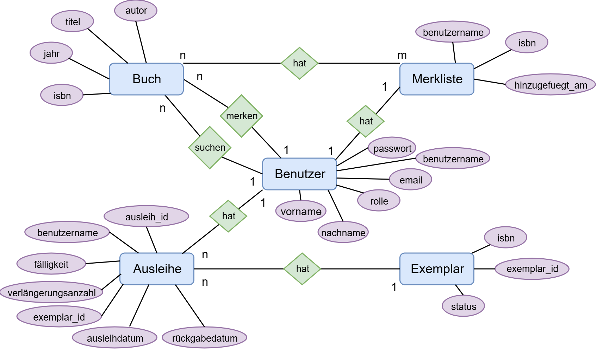

# Bibflow :books:
Dieses Projekt ist ein webbasiertes Bibliothekssystem, das die Verwaltung und Ausleihe von Büchern übersichtlich und effizient gestaltet. Unterschiedliche Funktionen für Administratoren und Benutzer sorgen für eine klare und strukturierte Nutzung.


## Projekt Setup

### 1. Project Setup
- Python 3.13 oder die im Kurs verwendete Python-Version ist erforderlich.
- Ein aktueller Webbrowser wird für die Nutzung der Oberfläche benötigt.
- Das Projekt nutzt eine lokale SQLite-Datenbank und benötigt keine separate Datenbankinstallation.

### 2. Virtuelle Umgebung anlegen
macOS/Linux:
```bash
python3 -m venv .venv
source .venv/bin/activate
```

Windows:
```powershell
py -m venv .venv
.venv\Scripts\Activate.ps1
```

Falls PowerShell das Aktivieren blockiert, kann alternativ die Eingabeaufforderung verwendet werden:
```bat
.venv\Scripts\activate.bat
```

### 3. Abhängigkeiten installieren
```bash
pip install -r requirements.txt
```

### 4. Configuration
- Für Bibflow sind keine zusätzlichen Umgebungsvariablen oder geheimen Schlüssel nötig.
- **Die App-Datenbank ist `bibliothek_orm.db`** im Projektstamm (SQLite). Alle Benutzer, Bücher und Ausleihen liegen dort.
- Die Datei wird beim ersten Start automatisch angelegt und steht in der `.gitignore` (wird nicht nach GitHub hochgeladen).
- Test-Datenbanken aus `Test_Cases/` und `Datenbank/TC_002_*` liegen nur im System-Temp und werden nach den Tests gelöscht.
- Für einen Neustart mit leerer DB: `bibliothek_orm.db` löschen und die App erneut starten - der lokale Admin wird dann neu angelegt (siehe Abschnitt 7).

### 5. Launch
Aus dem Projektordner starten (Haupteinstiegspunkt `main.py` im Root):

macOS/Linux:
```bash
python main.py
```

Windows:
```powershell
py main.py
```

Die Anwendung startet auf `http://127.0.0.1:8080`. Öffne die Adresse im Browser, sobald sie in der Konsole ausgegeben wird.

### 6. Usage
- Die Login-Seite öffnen und sich mit einem bestehenden Konto anmelden.
- Den Tab **Bücher** öffnen und verfügbare Titel durchsuchen.
- Ein verfügbares Exemplar auswählen und den Ausleihvorgang starten.
- Die Seite **Meine Ausleihen** aufrufen, um Fälligkeitsdatum und Status zu prüfen.


### 7. Lokaler Admin-Zugang (für Test & Abgabe)

Zum Prüfen der **Administrator-Funktionen** (Bibliothek verwalten) mit der echten App-Datenbank `bibliothek_orm.db`:

| Feld | Wert |
|------|------|
| **Benutzername** | `admin1` |
| **Passwort** | `admin123` |
| **Rolle** | `Admin` |

**Ablauf:**
1. App starten: `python main.py`
2. Im Browser `http://127.0.0.1:8080` öffnen
3. Mit `admin1` / `admin123` einloggen
4. Tab **Admin** erscheint - dort Bücher erfassen/bearbeiten/löschen, Exemplare verwalten, überfällige Ausleihen einsehen

**Immer verfügbar:** Beim App-Start ist der lokale Admin `admin1` in `bibliothek_orm.db` garantiert vorhanden und mit `admin123` anmeldbar (wird angelegt, falls er fehlt; Passwort wird nur für `admin1` angepasst, wenn es nicht zum README passt).

**Gemeinsamer Demo-Bestand (Bücher):** Enthält die lokale DB noch **keine** Bücher, legt die App automatisch 17 Demo-Titel mit Exemplaren an (Quelle: `Datenbank/seed_demo_daten.py` im Repo).

**Demo-Benutzer** (Ausleihe, Merkliste, Popups testen):

| Benutzername | Passwort | Rolle |
|--------------|----------|-------|
| `demo` | `demo123` | `Benutzer` |

`demo` hat nach dem Start zwei Demo-Ausleihen (`seed_demo_daten.py`):

- **Überfällig** (*1984*) -> Popup „Überfällige Bücher“ (`popup_ueberfaellige_fuer_benutzer`)
- **Bald fällig** (*Harry Potter*, Fälligkeit in weniger als 7 Tagen) -> Reminder-Popup

**Popups testen:** mit `demo` / `demo123` einloggen - **nicht** als `admin1` (Admins sehen diese Dialoge nicht).

Über **Registrieren** in der UI ist nur die Rolle `Benutzer` möglich - Admin-Rechte sind bewusst nicht öffentlich registrierbar.

**Login klappt trotzdem nicht?** `bibliothek_orm.db` löschen und App neu starten - `admin1` wird dann frisch mit obigen Zugangsdaten angelegt.

### 8. `.gitignore` (für GitHub)

Im Projekt liegt eine `.gitignore`, damit lokale Dateien nicht ins Repository gelangen. Ausgeschlossen werden u. a.:

- **Python:** `.venv/`, `__pycache__/`, `*.pyc`, Build-Artefakte
- **IDE & Editor:** `.idea/` (PyCharm), `.vscode/`, `.cursor/`, Vim/Emacs-Swapfiles
- **OS-Artefakte:** `.DS_Store` (macOS), `Thumbs.db` (Windows), Linux-Trash
- **Caches:** `.pytest_cache/`, `.mypy_cache/`, `.ruff_cache/`, `.nicegui/`
- **Projekt:** `bibliothek_orm.db`, `logs/`, `test_*.db`, `.env` (Secrets)

**Hinweis:** Die SQLite-Datei selbst liegt nicht in Git. Der gemeinsame **Demo-Buchkatalog** steht in `Datenbank/seed_demo_daten.py` und wird beim ersten Start automatisch in die lokale `bibliothek_orm.db` importiert.

## Problem
In der Bibliothek «Bibflow» ist die Verwaltung der Bücher und Ausleihen unübersichtlich, weil keine zentrale Lösung vorhanden ist. Benutzer wissen oft nicht, ob ein Buch verfügbar ist, und haben keinen Überblick über ihre Ausleihen. Zudem ist den Benutzern nicht bewusst, welche die beliebtesten Bücher in der Bibliothek sind. Dies führt häufig zu verspäteten Rückgaben und Missverständnissen zwischen Benutzern und Mitarbeitern.

## Szenario
Benutzer verwenden diese Applikation, wenn sie Bücher ausleihen möchten und den Überblick über ihre Ausleihen behalten wollen. Bei Bedarf können die Ausleihen verlängert werden. Dadurch wird das Problem der unübersichtlichen Verwaltung von Büchern und Ausleihen gelöst.

## Hauptfunktionen

### Administrator
- Bücher erfassen, bearbeiten und löschen
- Verfügbarkeit von Exemplaren verwalten
- Überfällige Bücher einen Reminder auslösen

### Benutzer
- Alle Bücher durchsuchen und anzeigen
- Beliebteste Bücher sehen auf der Startseite
- Bis zu 5 Bücher gleichzeitig ausleihen
- Man kann pro Buch 1x verlängern
- (Persönliche Merkliste verwalten)
- "Meine Ausleihen" zeigt aktuelle Ausleihen sortiert nach Fälligkeit (früheste Fälligkeit oben). 

### Ausleihe 
- 30 Tage Standard-Ausleihdauer
- Automatische Erinnerung bei < 7 Tagen Restlaufzeit
- Pop-up bei überfälligen Büchern
- Echtzeit-Status der Buchverfügbarkeit

## User Stories

### User Story 1: Bücher erfassen 
- Als Administrator möchte ich Bücher erfassen, damit die Bibliothek aktuell bleibt.
---
### User Story 2: Buchinformationen bearbeiten 
- Als Administrator möchte ich Buchinformationen bearbeiten können, damit Daten korrekt sind.
---
### User Story 3: Bücher löschen 
- Als Administrator möchte ich Bücher löschen, damit veraltete Medien entfernt werden.
---
### User Story 4: Bücher freigeben 
- Als Administrator möchte ich zurückgegebene Bücher wieder freigeben können, damit sie wieder ausgeliehen werden können.
---
### User Story 5: Bücher durchsuchen 
- Als Benutzer möchte ich alle Bücher durchsuchen, damit ich interessante Titel finde.
---
### User Story 6: Beliebte Bücher anzeigen 
- Als Benutzer möchte ich beliebteste Bücher sehen, damit ich weiss was gut ist.
---
### User Story 7: Bücher ausleihen 
- Als Benutzer möchte ich Bücher ausleihen, damit ich sie lesen kann.
---
### User Story 8: Ausleihe verlängern 
- Als Benutzer möchte ich Ausleihen verlängern, damit ich mehr Zeit zum Lesen habe.
---
### User Story 9: Eigene Ausleihe anzeigen
- Als Benutzer möchte ich meine Ausleihen nach Fälligkeit sortiert sehen, damit ich den Überblick habe
---
### User Story 10: Bücher in die Merkliste hinzufügen 
- Als Benutzer möchte ich Bücher merken, damit ich sie später leicht finde.
---
## Use Cases


### USE CASE 1: Registrieren (Benutzer)
1. Benutzer öffnet die Registrierungsseite
2. Benutzer gibt Benutzername, Passwort, Vorname, Nachname und E-Mail ein
3. System prüft Pflichtfelder und Validität
4. System prüft, ob Benutzername und E-Mail eindeutig sind
5. System speichert den neuen Benutzer mit Standardrolle "Benutzer"
6. Benutzer kann sich anschliessend einloggen

### USE CASE 2: Login mit rollenbasierter Ansicht (Benutzer/Admin)
1. Benutzer öffnet die Login-Seite
2. Benutzer gibt Benutzername und Passwort ein
3. System prüft die Zugangsdaten 
4. Bei korrekten Daten prüft das System die Rolle
5. Benutzer mit Rolle "Benutzer" gelangt zur Benutzeransicht
6. Benutzer mit Rolle "Admin" oder "Administrator" gelangt zur Admin-Ansicht

### USE CASE 3: Buch ausleihen (Benutzer)
1. Benutzer loggt sich ein
2. Benutzer sucht nach einem Buch
3. System zeigt verfügbare Exemplare an
4. Benutzer wählt ein Exemplar aus
5. System prüft, ob Benutzer weniger als 5 aktive Ausleihen hat
6. System erstellt eine Ausleihe (Standardfrist 30 Tage) und speichert sie
7. Exemplar-Status wird auf "ausgeliehen" gesetzt
8. Ausleihe erscheint in "Meine Ausleihen"

### USE CASE 4: Buch erfassen (Administrator)
1. Administrator loggt sich ein
2. Administrator wählt "Buch erfassen"
3. Administrator gibt ISBN, Titel, Autor und Jahr ein
4. Administrator legt die Anzahl der Exemplare fest
5. System validiert ISBN (mind. 13 Ziffern), Jahr (4-stellig, nicht in Zukunft) und Eindeutigkeit
6. System speichert das Buch und legt Exemplare an
7. Exemplare erhalten den Status "verfügbar"

### USE CASE 5: Exemplar verwalten (Administrator)
1. Administrator loggt sich ein
2. Administrator öffnet die Exemplarverwaltung / Buchverwaltung
3. Administrator wählt ein Buch und sieht die zugehörigen Exemplare
4. Administrator kann Exemplare hinzufügen (Anzahl erhöhen)
5. Administrator kann ein Exemplar löschen (sofern nicht ausgeliehen)
6. Administrator kann den Status eines Exemplars manuell setzen (z. B. "verfügbar", "ausgeliehen")
7. System speichert die Änderungen und aktualisiert die Verfügbarkeit

### USE CASE 6: Buch löschen (Administrator)
1. Administrator loggt sich ein
2. Administrator öffnet die Buchverwaltung
3. Administrator wählt ein Buch zum Löschen aus
4. System prüft, ob das Buch existiert
5. System verhindert das Löschen, falls noch Exemplare ausgeliehen sind
6. Falls möglich, löscht das System die Exemplare und das Buch
7. Buch erscheint nicht mehr im Bestand

### USE CASE 7: Ausleih verlängern (Benutzer)
1. Benutzer loggt sich ein
2. Benutzer öffnet "Meine Ausleihe"
3. Benutzer wählt eine aktive Ausleihe
4. System prüft, ob die Ausleihe noch verlängerbar ist (nur 1x erlaubt)
5. System verlängert die Frist um 14 Tage und speichert die Änderung

### USE CASE 8: Buch verfügbar machen (Administrator)
1. Administrator loggt sich ein
2. Administrator wählt ein zurückgegebenes Exemplar
3. System setzt den Exemplar-Status auf "verfügbar"
4. System markiert die Ausleihe als zurückgegeben
5. Exemplar ist wieder ausleihbar

### USE CASE 9: Buch zur Merkliste hinzufügen (Benutzer)
1. Benutzer loggt sich ein
2. Benutzer merkt ein Buch
3. System prüft, ob Benutzer und Buch existieren
4. System verhindert Duplikate auf der Merkliste
5. System speichert den Merkliste-Eintrag

### Akteure
- Administrator
- Benutzer

## Mockup

## Architektur


## Klassenstruktur


### Zu den Klassen
- `User` / `Administrator`: Speichern Benutzerdaten und unterscheiden normale Benutzer von Admins.
- `Buch`: Enthält die bibliografischen Daten wie Titel, Autor, ISBN und Jahr.
- `Exemplar`: Repräsentiert ein einzelnes physisches Buch mit eigenem Status wie `verfuegbar` oder `ausgeliehen`.
- `Ausleihe`: Verwaltet Ausleihdaten wie Benutzer, Exemplar, Fälligkeit und Verlängerung.
- `Merkliste`: Speichert vorgemerkte Bücher pro Benutzer.


## Datenbank 
Die Datenbank beinhaltet die folgenden Entitäten:

- **Benutzer** (`User` / `Administrator`)
- **Buch** (`Buch`)
- **Exemplar** (`Exemplar`)
- **Ausleihe** (`Ausleihe`)
- **Merkliste-Eintrag** (`MerklisteEintrag`)

### ER-Diagramm


## Projektanforderungen
Die folgenden Anforderungen wurden für Bibflow umgesetzt und dienen als Nachweis für die Projektabgabe:

- Die Anwendung wurde mit NiceGUI als interaktive webbasierte Oberfläche umgesetzt.
- Die Eingaben werden in den Service-Klassen geprüft und validiert, bevor Daten gespeichert oder verändert werden.
- Für die Datenverwaltung wird ein ORM eingesetzt, konkret SQLAlchemy mit einer lokalen SQLite-Datenbank.
- Die Anwendung ist rollenbasiert aufgebaut und trennt Benutzer- und Administratorfunktionen klar voneinander.

### Browser-Based App

Die Anwendung ist browserbasiert und läuft in modernen Webbrowsern ohne separaten Desktop-Client. Das Frontend kommuniziert über die Service-Schicht mit dem Backend und zeigt Echtzeit-Statusupdates (z. B. Verfügbarkeit von Exemplaren). Die Oberfläche ist auf einfache Bedienbarkeit für Benutzer und Administratoren optimiert.

### Datenvalidierung
Die Applikation stellt sicher, dass alle Eingaben und Operationen durch gezielte Prüfungen in den Service-Klassen validiert werden, bevor Daten in der Datenbank gespeichert oder verarbeitet werden. Wichtige Validierungsregeln im Projekt sind:

### 1. Benutzer
- Registrierung: Pflichtfelder (`Benutzername`, `Passwort`, `Vorname`, `Nachname`, `E-Mail`) werden auf Nicht-Leer geprüft; `Benutzername` und `E-Mail` müssen eindeutig sein. Neue Benutzer erhalten standardmäßig die Rolle `Benutzer`.
- Login: Bei falschen Zugangsdaten wird aus Sicherheitsgründen die einheitliche Fehlermeldung "Benutzername oder Passwort ist falsch." verwendet.
- Rollen: Die Werte `Admin` oder `Administrator` werden als Administratorrolle erkannt.

### 2. Buch
- ISBN: Es wird geprüft, dass die ISBN mindestens 13 Ziffern enthält und dass keine ISBN-Duplikate existieren.
- Jahr: Das Erscheinungsjahr muss vierstellig, mindestens `1000` und darf nicht in der Zukunft liegen.
- Exemplare: Beim Anlegen ist `exemplar_anzahl >= 1`; Exemplare werden beim Erfassen erzeugt und erhalten den Status `verfügbar`.
- Löschen: Nur Benutzer mit Admin-Rechten dürfen Bücher löschen; das Löschen wird verhindert, solange Exemplare des Buches ausgeliehen sind.

### 3. Ausleihe
- Maximalanzahl: Ein Benutzer darf höchstens 5 aktive Ausleihen gleichzeitig haben.
- Frist: Standard-Ausleihdauer beträgt 30 Tage.
- Verlängerung: Eine Ausleihe kann nur einmalig verlängert werden; die Verlängerung addiert 14 Tage zur aktuellen Fälligkeit.
- Rückgabe: Bei Rückgabe wird die Ausleihe als zurückgegeben markiert und das Exemplar auf `verfügbar` gesetzt.

### 4. Merkliste
- Existenzprüfung: Beim Hinzufügen wird geprüft, ob Benutzer und Buch existieren.
- Duplikatschutz: Doppelte Einträge werden verhindert.

## Verwendete Bibliotheken

- NiceGUI — UI Frontend
- SQLAlchemy — ORM Backend
- SQLite3 — Lokale Datenbank
- uuid — ID Erzeugung
- typing, datetime — Standard Bibliothek
- bcrypt — Passwort-Hashing

## Repository Struktur

## Projektmanagement
### Projektziele
- Zentralisierte Verwaltung von Büchern und Ausleihen.
- Klare Trennung von Administrator- und Benutzerfunktionen.
- Browserbasierte Oberfläche mit NiceGUI.
- Benutzerfreundlichkeit und intuitive Bedienbarkeit für alle Nutzer.

### Verteilung
| Name | Beitrag |
|------|--------------|
| Sena | Backend + Dokumentation |
| Naomi | Datenbanken & ORM + Dokumentation |
| Giulia | Frontend UI + Dokumentation |

### Herausforderungen

